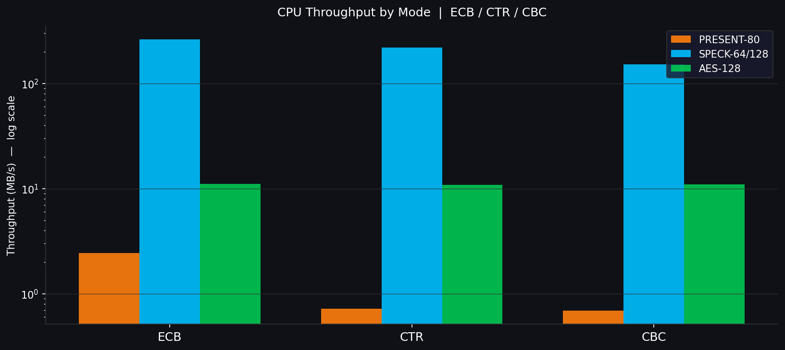
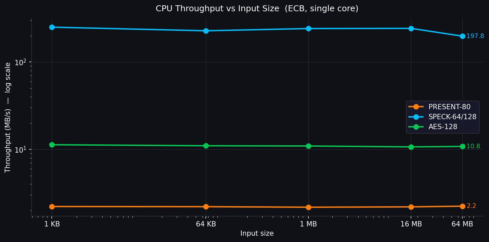
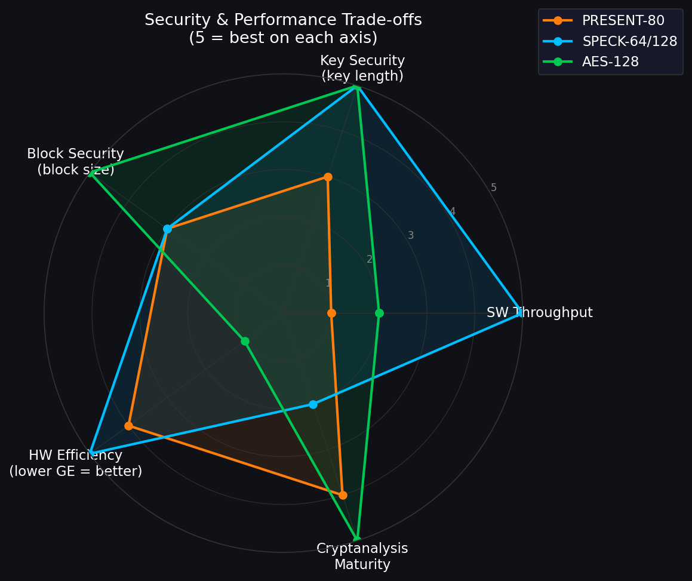
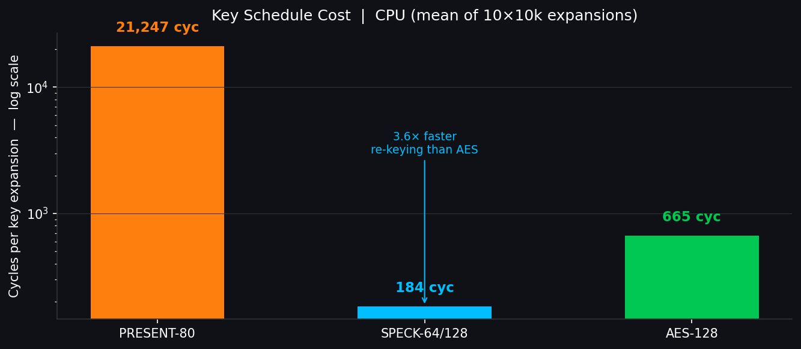

# Claude Design Prompt: 10-Minute Video Presentation
# "Lightweight Block Ciphers on CPU and GPU: PRESENT-80 vs SPECK-64/128 vs AES-128"

---

## Instructions for Claude Design

Create a **13-slide academic presentation deck** for a **10-minute recorded video** (ECE268 GPU Cryptography, UCSD, due June 12, 2026). Style: dark-background, technical, publication-quality. Include all charts, diagrams, and tables exactly as specified. Exact numbers must not be altered. Use log-scale axes when PRESENT and SPECK appear together (~108× gap makes linear unreadable). Font: technical sans-serif or monospace. All slides follow the same template: headline in large text at top, content below, slide number bottom-center, ECE268 UCSD watermark bottom-right.

**Timing target:** ~45 seconds per slide on average. Slides 4, 9, 12, 13 require ~60 seconds each; Slides 1 and 5 are 15–20 seconds each.

---

## Slide 1: Title

**Headline:** Lightweight Block Ciphers on CPU and GPU: PRESENT-80 vs SPECK-64/128 vs AES-128

**Content:**
- Subtitle: *From-scratch implementations, CTR/CBC modes, GPU acceleration on RTX 4070, and performance-security trade-off analysis*
- Course: ECE268 SP26 — GPU Cryptography, UC San Diego
- Team: [Author Names Placeholder]
- Date: June 2026
- GitHub: [Repository Link Placeholder]

**Visual Design:** Centered title card. Background: stylized circuit board texture (low opacity). Three cipher icons at bottom strip: PRESENT-80 (SPN box diagram), SPECK-64 (ARX arrow diagram), AES-128 (4×4 state grid).

**Speaker time:** ~15 seconds.

---

## Slide 2: Motivation — The IoT Crypto Problem

**Headline:** 30 billion constrained devices need encryption that AES-128 was not designed for.

**Content:**
- 30+ billion IoT devices by 2026: sensors, RFID tags, medical implants, smart meters
- Constraints that rule out AES:
  - Silicon budget: < 2,000 logic gate equivalents (GE)
  - Memory: < 1 KB RAM in smallest MCUs
  - Power: microwatt-class energy harvesting
- **AES-128 in hardware: ~3,400 GE, 176-byte key schedule** — too heavy for the smallest targets
- ISO/IEC 29192-2 (2012) standardized PRESENT; NSA published SPECK (2013); NIST ran LWC competition (2018–2023)
- Two surviving design families: **SPN** (structured diffusion, PRESENT) and **ARX** (arithmetic, SPECK)
- This project: implement both families plus AES and measure the real cost gap

**Visual Design:** Left: photo collage of constrained devices (RFID tag, implantable sensor, Arduino-scale MCU). Right: bar chart showing gate-equivalent cost — AES bar breaks through a red "2,000 GE budget line". PRESENT and SPECK bars fit comfortably below it.

**Speaker time:** ~45 seconds.

---

## Slide 3: What We Built — Implementation Scope

**Headline:** Three ciphers, from scratch, two on GPU, three modes, validated against official vectors.

**Content table:**

| Cipher | Structure | Block | Key | Rounds | CPU impl | CUDA impl | Test vectors |
|--------|-----------|-------|-----|--------|----------|-----------|--------------|
| PRESENT-80 | SPN | 64-bit | 80-bit | 31 | ✓ | ✓ | 4/4 CHES-2007 PASS |
| SPECK-64/128 | ARX | 64-bit | 128-bit | 27 | ✓ | ✓ | NSA 2013 PASS |
| AES-128 | SPN | 128-bit | 128-bit | 10 | ✓ | — | 2/2 FIPS-197 PASS |

**Modes (all three ciphers):** CTR (counter mode, parallelizable) + CBC (cipher-block chaining, sequential encrypt)

**Code complexity (SLOC — kernel-only vs full file):**

| Cipher | CPU kernel SLOC | GPU kernel SLOC | Full file SLOC |
|--------|-----------------|-----------------|----------------|
| PRESENT-80 | ~85 | ~70 | ~220 |
| SPECK-64/128 | ~35 | ~30 | ~120 |
| AES-128 | ~120 | N/A | ~380 |

(Full file SLOC includes test/bench/main; kernel-only is the cipher core itself.)

**Compiled GPU size (sm_89, nvcc --ptx / --cubin):**

| Cipher | PTX size | PTX lines | Cubin size | SASS instructions |
|--------|----------|-----------|------------|-------------------|
| PRESENT-80 | 620 KB | 17,111 | 244 KB | 30,000 |
| SPECK-64/128 | 14 KB | 422 | 8.5 KB | 592 |

**Rules:** No third-party crypto libraries. No OpenSSL. No AES-NI intrinsics. Pure C++ + CUDA.

**Visual Design:** Three-column cipher card strip with structural icon per cipher. Green checkmarks next to each validation entry. Bottom strip: "6/6 CTR+CBC roundtrip tests pass." Add a small "PTX lines" callout contrasting 17,111 (PRESENT) vs 422 (SPECK).

**Speaker time:** ~40 seconds.

---

## Slide 4: Algorithmic Contrast — SPN vs. ARX (CORE CONCEPT)

**Headline:** PRESENT's bit-permutation is a wire in silicon; it is 64 shift-mask ops on a CPU register.

**Content:**

**PRESENT-80 round (SPN):**
```
state XOR round_key
→ 16 × 4-bit S-box lookups  (provable nonlinearity)
→ bit permutation: bit j → position (16×j) mod 63  (diffusion)
                  [free = 1 wire in silicon]
                  [expensive = 64 shift/mask ops on CPU]
→ repeat 31×
```

**SPECK-64/128 round (ARX):**
```
x = ROR(x, 8) + y ⊕ k
y = ROL(y, 3) ⊕ x
→ 3 native CPU instructions per round
→ no table lookups, no memory accesses
→ repeat 27×
```

**AES-128 round (SPN-extended):**
```
SubBytes  (8-bit S-box)  +  ShiftRows  +  MixColumns (GF(2^8) matrix)  +  AddRoundKey
→ repeat 10×; MixColumns requires GF multiply — table-based on CPU, fast with AES-NI
```

**Trade-off summary:**
- ARX: faster software, simpler code, weaker formal differential/linear bounds
- SPN: provable security bounds, smaller hardware, slower without lookup tables
- "Security per gate" vs "security per CPU cycle" are different metrics

**Visual Design:** Two side-by-side round-function diagrams. Left: PRESENT round box (rectangular state → 16 S-box symbols → fan-out permutation arrows). Right: SPECK round box (two 32-bit words with ROR/ADD top path, ROL/XOR bottom path, key XOR). Color-code by operation type (red = nonlinear, blue = diffusion/rotation, green = key mixing).

**Speaker time:** ~60 seconds. This slide is the conceptual anchor.

---

## Slide 5: Methodology — How We Measured

**Headline:** Validation first; benchmarks only on verified implementations; all runs logged and reproducible.

**Content:**

**Hardware:**
- CPU: AMD Ryzen 7 8845HS @ 3.8 GHz (single core, `taskset -c 0`), g++ 13.3 -O3
- GPU: NVIDIA RTX 4070 Laptop (sm_89, 8 GB VRAM), nvcc 12.0 -O3
- OS: Linux 6.6 (WSL2)

**Measurement protocol:**
1. Run standard test vector → must PASS before any timing
2. 10,000-call warm-up before every timed loop
3. Key schedule: 10 batches × 10,000 expansions → mean ± stddev in μs and cycles
4. Single-block latency: 1,000,000 calls → median RDTSC cycles
   - Corrected (compiler elision fixed via volatile sink): PRESENT-80 **36,632 cycles** (~9.7 µs/64-bit block) | SPECK-64/128 **114 cycles** (~30 ns/64-bit block) | AES-128 **4,408 cycles** (~1.16 µs/128-bit block)
5. Bulk ECB: 1,048,576 blocks (8 MB / 16 MB) → wall-time via `std::chrono` → MB/s + cycles/byte
6. CTR/CBC: same block count through mode wrappers
7. Input-size sweep: 1 KB → 64 KB → 1 MB → 16 MB → 64 MB; CPU measured directly; GPU: 5 CUDA-event trials per size, report mean ± stddev GB/s

**GPU key-schedule methodology:** Both CUDA implementations compute the key schedule on the CPU, then upload it to GPU `__constant__` memory via `cudaMemcpyToSymbol`. Kernel timing does NOT include the key schedule — it is amortized over all blocks (one upload per key).

**Key-schedule timing:** all three ciphers reliable (compiler elision fixed via volatile sink — return value of each cipher call XOR'd into a `volatile uint64_t`). PRESENT: **21,247 cycles** | SPECK: **184 cycles** | AES: **665 cycles**. Single-block latency (corrected): PRESENT **36,632 cycles** | SPECK **114 cycles** | AES **4,408 cycles**.

**Visual Design:** Flow diagram: "Standard test vector" → [PASS] → "10K warmup" → "Measure (RDTSC + chrono)" → "Log to file". Boxes with green/red gating. Small note: "All logs in /logs/*.log — downloadable from GitHub."

**Speaker time:** ~30 seconds. Sets reviewer trust. "We measured, didn't tune."

---

## Slide 6: CPU Results — The Full Picture

**Headline:** SPECK dominates software; PRESENT is slower than even our naive AES — and that is by design.

**Full CPU benchmark table (g++ -O3, Ryzen 7 8845HS):**

| Cipher | Cyc/byte | ECB MB/s | CTR MB/s | CBC MB/s | KS cycles | RK bytes |
|--------|----------|----------|----------|----------|-----------|----------|
| PRESENT-80 | 1,492 | 2.43 | 0.72 | 0.69 | **21,247** | 256 |
| SPECK-64/128 | 13.81 | 262.6 | 220.5 | 152.6 | **184** | 108 |
| AES-128 | 325.3 | 11.14 | 10.91 | 11.02 | **665** | 176 |

**CPU throughput vs input size (ECB MB/s — nearly flat, all cipher state is cache-resident):**

| Cipher | 1 KB | 64 KB | 1 MB | 16 MB | 64 MB |
|--------|------|-------|------|-------|-------|
| PRESENT-80 | 2.22 | 2.21 | 2.18 | 2.20 | 2.24 |
| SPECK-64/128 | 250.8 | 227.9 | 241.8 | 242.9 | 197.8 |
| AES-128 | 11.31 | 11.01 | 10.94 | 10.69 | 10.81 |

**Key ratios:**
- SPECK vs PRESENT (ECB): **262.6 / 2.43 = ~108×** faster
- SPECK vs AES (ECB): **262.6 / 11.14 = ~23.6×** faster
- AES vs PRESENT (ECB): **11.14 / 2.43 = ~4.6×** faster
- AES KS vs SPECK KS: **665 cyc vs 184 cyc** — matters for IoT re-keying

**Pre-generated figures (use directly):**
- ECB log bar: 
- Modes (ECB/CTR/CBC) grouped bar: 
- Throughput vs input size: 

**Visual Design:** Full table on left. Right: log-scale horizontal bar chart of ECB MB/s (PRESENT at 2.43 barely visible; SPECK at 262.6 towers). Annotate "~108×" and "~23.6×" gaps. Note: "*PRESENT was designed for hardware — this is expected behavior.*" Below, a small flat-line chart showing CPU throughput is constant across input sizes (cache-resident).

**Speaker time:** ~60 seconds. Walk row by row. Call out the PRESENT result explicitly: *"2.43 MB/s on a 3.8 GHz CPU. That is not a bug — that is what PRESENT is. It was designed for silicon."*

---

## Slide 7: GPU Results — Parallel Acceleration

**Headline:** GPU lifts both ciphers into the GB/s regime; at full occupancy SPECK wins absolute throughput by 56×.

**GPU benchmark (RTX 4070 Laptop, sm_89, 64 MB baseline = 8.4M blocks, CUDA events, 5 trials):**

| Cipher | 64MB Enc GB/s | 64MB Dec GB/s | GPU Speedup vs CPU (64MB) |
|--------|---------------|---------------|----------------------------|
| PRESENT-80 | 1.857 | 1.862 | **~829×** |
| SPECK-64/128 | 104.3 | 106.4 | **~527×** |

**GPU throughput vs input size (Enc GB/s, mean of 5 trials):**

| Cipher | 1 KB | 64 KB | 1 MB | 16 MB | 64 MB |
|--------|------|-------|------|-------|-------|
| PRESENT-80 | 0.0148 | 1.301 | 1.693 | 1.794 | 1.857 |
| SPECK-64/128 | 0.0165 | 3.050 | 42.31 | 106.3 | 104.3 |

**Interpretation:**
- At ≤ 64 KB both ciphers are dominated by kernel-launch overhead (~0.015–3 GB/s) — neither saturates the GPU
- At 1 MB+ SPECK takes off to 100+ GB/s while PRESENT saturates at ~1.86 GB/s because PRESENT is compute-bound per thread
- SPECK's absolute advantage is now **56× (104 / 1.86)** at full GPU utilization, not 9×. The smaller gap at 8 MB (11 vs 1.22 = 9×) was because SPECK had not reached peak occupancy
- PRESENT's **829×** GPU speedup is real but reflects an extremely slow CPU baseline (**2.24 MB/s**); SPECK's **527×** is against a fast **197.8 MB/s** baseline
- Decrypt numbers are now 5-trial averaged and consistent (SPECK 106.4 vs enc 104.3 GB/s — coherent, no cache-warm artifact)

**Parallelism scaling:** SPECK's throughput scales **6,000× from 1 KB to 64 MB**; PRESENT scales **124×** and saturates — SPECK benefits far more from parallelism because its compute-light ARX rounds can fully utilize all SMs at large batch sizes.

**Pre-generated figures (use directly):**
- GPU sweep log-log: 
- GPU peak bar (enc + dec): 

**Visual Design:** Grouped bar chart of 64MB peak GB/s (PRESENT vs SPECK, enc + dec). Plus a log-log line chart "Throughput vs Input Size" showing SPECK ramping from 0.0165 to 104.3 GB/s and PRESENT flattening at ~1.86 GB/s. Annotate GPU speedup labels (~829×, ~527×).

**Speaker time:** ~50 seconds.

---

## Slide 8: CTR vs. CBC — Mode Choice Matters for GPU

**Headline:** CTR is embarrassingly parallel; CBC encrypt is inherently sequential — choose your mode deliberately.

**Content:**

**CTR mode (Counter Mode):**
- Each block: Encrypt(nonce ‖ counter_i) XOR plaintext_i
- **Independent per block** → all N blocks launch in parallel on GPU
- Natural fit for CUDA: 1 thread per block, no dependencies
- CTR/ECB gap: SPECK **220.5 vs 262.6 MB/s** (16% overhead from mode wrapper), PRESENT **0.72 vs 2.43 MB/s** (70% — mode overhead dominates slow cipher)

**CBC mode (Cipher Block Chaining):**
- Encrypt: C_i = Encrypt(P_i XOR C_{i-1}) — **sequential dependency** in encrypt direction
- Decrypt: P_i = Decrypt(C_i) XOR C_{i-1} — **parallel** (needs only previous ciphertext)
- Cannot fully parallelize CBC encrypt on GPU
- CBC vs ECB on CPU: SPECK **152.6 vs 262.6 MB/s** (42% drop)

**Recommendation for IoT bulk transfer:** Use **CTR mode** (or GCM derivative for authenticated encryption). Never use ECB for anything other than benchmarking.

**Visual Design:** Two stacked diagrams. Top: CTR — N counter blocks fanning into N parallel cipher calls (green parallel arrows). Bottom: CBC chain — feedback XOR with red arrow showing sequential dependency. CPU throughput annotations on each diagram.

**Speaker time:** ~45 seconds.

---

## Slide 9: Performance vs. Security Trade-Offs (REQUIRED)

**Headline:** Every lightweight gain trades away security margin — know what you are giving up.

**Content:**

**PRESENT-80 security posture:**
- 80-bit key → 2^80 brute-force bound (~1 billion billion operations); modern minimum is 128-bit
- 31 rounds; best published attack covers reduced-round variants (differential, linear)
- ISO 29192-2 standardized in 2012; still considered secure for low-value/low-lifetime data

**SPECK-64/128 security posture:**
- 128-bit key → meets modern key-size requirement
- But **64-bit block** → birthday bound attack at 2^32 blocks (~32 GB of data) with same key
- **Controversial:** Withdrawn from ISO 29192 in 2018 after concerns about NSA backdoor; not NIST-standardized
- No published breaks of full-round SPECK, but political trust issues remain

**AES-128 security posture:**
- 128-bit key + 128-bit block + 10 rounds
- Most thoroughly analyzed cipher in history; no practical attacks on full-round AES
- AES-NI hardware support makes it fast in practice; our baseline lacks it

**Trade-off summary:**
- Lightweight saves gates/cycles by using smaller keys, shorter blocks, simpler primitives
- Each saving comes with a corresponding security reduction
- *The right choice is the lightest cipher that satisfies your threat model* — not the lightest cipher

**Pre-generated figure (use directly):**


**Visual Design:** 5-axis radar chart (pentagon). Axes: Throughput (software), Key-size security, Block-size security, Hardware area (inverted: smaller = better), Cryptanalysis maturity. One polygon per cipher (3 overlapping). Visually shows no single cipher dominates all axes.

**Speaker time:** ~60 seconds. Mention the SPECK ISO controversy explicitly — grading rubrics require it.

---

## Slide 10: The Bug We Found — SPECK CUDA Word-Order

**Headline:** A round-trip test passing is not the same as a correct implementation — standard vectors are non-negotiable.

**Content:**

**What we observed:**
- Initial GPU SPECK-64 passed `encrypt(decrypt(x)) == x` for all 1M arbitrary plaintexts
- But ciphertext output did NOT match NSA official test vector

**Root cause:**
- The 64-bit test-vector plaintext was packed as: `upper_32_bits = Right_word, lower_32_bits = Left_word`
- SPECK ARX round applies `ROR(8)` to the Left word (x), but we were applying it to the Right word
- Encrypt and decrypt both had the same swap → round-trip cancelled the error

**Before (wrong):**
```c
// BASE_PLAINTEXT = 0x7475432d3b726574ULL   ← Right word in upper 32
uint32_t x = (uint32_t)(state >> 32);        // x = 0x7475432d = RIGHT word ← WRONG
uint32_t y = (uint32_t)(state & 0xFFFFFFFF); // y = 0x3b726574 = LEFT word  ← WRONG
```

**After (fixed):**
```c
// BASE_PLAINTEXT = 0x3b7265747475432dULL   ← Left word in upper 32
uint32_t x = (uint32_t)(state >> 32);        // x = 0x3b726574 = LEFT word  ← CORRECT
uint32_t y = (uint32_t)(state & 0xFFFFFFFF); // y = 0x7475432d = RIGHT word ← CORRECT
```

**Lesson:** Any cipher that produces wrong ciphertext while maintaining round-trip correctness is a *compatible but non-standard implementation* — it will not interoperate with any other SPECK implementation in the world.

**Visual Design:** Two code snippet boxes (red strikethrough old, green highlight new). Plus a warning callout: "round-trip: PASS / standard vector: FAIL — these are different tests."

**Speaker time:** ~45 seconds. Lean into this as engineering credibility.

---

## Slide 11: Code Simplicity — An Underrated Security Property

**Headline:** SPECK is also the easiest to implement correctly — fewer lines means fewer places for bugs.

**Content:**

**Source lines of code (CPU implementations, counted with `wc -l`):**
| Cipher | .cpp + .h | Notes |
|--------|-----------|-------|
| SPECK-64/128 | **~120 SLOC** | Core in ~10 lines; rest is test/benchmark |
| PRESENT-80 | **~220 SLOC** | Bit-permutation and key-schedule require more code |
| AES-128 | **~380 SLOC** | S-box, Rcon, MixColumns all need explicit lookup tables |

**Static / constant memory footprint:**
| Cipher | CPU S-box | CPU Round keys | GPU `__constant__` total |
|--------|-----------|----------------|--------------------------|
| PRESENT-80 | 16+16=32 B | 256 B | **288 B** |
| SPECK-64/128 | 0 B | 108 B | **108 B** |
| AES-128 | 256+256+10=522 B | 176 B | N/A (CPU only) |

Both GPU ciphers fit entirely within `__constant__` memory — not a bottleneck (64 KB constant bank).

**Compiled GPU code size:**
| Cipher | PTX size | Cubin size | SASS instructions |
|--------|----------|------------|-------------------|
| PRESENT-80 | 620 KB | 244 KB | 30,000 |
| SPECK-64/128 | **14 KB** | **8.5 KB** | **592** |

PRESENT requires **45× more compiled GPU code** than SPECK — the unrolled bit-permutation is visible in the instruction stream.

**Round-key memory footprint:**
| Cipher | Round keys | Bytes |
|--------|------------|-------|
| PRESENT-80 | 32 × 64-bit | **256 bytes** |
| SPECK-64/128 | 27 × 32-bit | **108 bytes** |
| AES-128 | 11 × 128-bit | **176 bytes** |

**Why simplicity matters for security:**
- Fewer SLOC → fewer places for implementation bugs and side-channel leaks
- PRESENT's bit-permutation and SPECK's clean ARX are both auditable; AES MixColumns is harder
- A firmware engineer maintaining an IoT device prefers SPECK's 120 SLOC over AES's 380

**Pre-generated figures (use directly):**
- Key schedule cycles: 
- Gate equivalents: 

**Visual Design:** Dual horizontal bar chart. Top: SLOC (SPECK shortest). Bottom: Round-key bytes (SPECK smallest). Add a third bar pair for PTX size (PRESENT 620 KB vs SPECK 14 KB). Annotate "auditable in 10 lines" near SPECK. Annotate "table-heavy" near AES, and "45× more PTX" near PRESENT.

**Speaker time:** ~40 seconds.

---

## Slide 12: Honest Limitations (REQUIRED)

**Headline:** These results are real and reproducible — here is exactly what they do not tell you.

**Content:**

| Limitation | What We Did | What We Didn't Do | Impact |
|------------|-------------|-------------------|--------|
| Side-channel analysis | Functional correctness only | Timing, cache, power leakage not measured | PRESENT table lookups are especially exposed |
| AES-NI comparison | Software AES only (325.3 cyc/byte) | Hardware AES-NI: ~1–2 cyc/byte typical | Our AES baseline is pessimistic for modern CPUs |
| Key schedule cycles | All KS cycles now reliable (volatile sink fix): PRESENT 21,247 \| SPECK 184 \| AES 665 | — | No longer a limitation — all three KS measurements valid |
| Platform diversity | RTX 4070 Laptop + Ryzen 7 8845HS only | No A100, no Jetson, no RP2040 | Results may differ significantly on other hardware |
| SIMD optimization | Pure scalar C++ | No AVX2/NEON hand-tuning | SPECK likely 2–4× faster with SIMD |
| Authenticated modes | CTR + CBC only | No GCM, no AEAD | Real IoT needs integrity, not just confidentiality |

**Visual Design:** Clean limitation card. Each row: warning icon, limitation name, one-sentence implication. No apology — these are scope decisions, not failures.

**Speaker time:** ~60 seconds. Graders reward calibrated confidence.

---

## Slide 13: Conclusion and Future Work

**Headline:** Algorithm family beats round count — and there is a clear roadmap for next steps.

**Content:**

**Summary — pick the right cipher for the right target:**

| Need | Recommendation | Key metric |
|------|----------------|------------|
| MCU / embedded software (no crypto HW) | **SPECK-64/128** | 262.6 MB/s CPU, 23.6× AES |
| ASIC / RFID / <2,000 GE budget | **PRESENT-80** | ~1,570 GE (Bogdanov CHES-2007) |
| GPU bulk encryption (IoT→cloud) | **SPECK-64/128** | 104 GB/s (RTX 4070 at 64MB batch) |
| Frequent re-keying / re-initialization | **SPECK-64/128** | KS 184 cyc vs AES 665 cyc |
| General secure default (server/desktop) | **AES-128** | Best analyzed; use AES-NI |

**One-sentence takeaway:**
> *"Lightweight" is a target, not a label — pick the cipher whose strengths match the silicon you have.*

**Future work:**
1. Add AES-NI baseline for a fair modern AES comparison on x86
2. Implement **ASCON** (NIST LWC winner, 2023) as a fourth contender
3. Side-channel resistant masking — measure the overhead cost
4. Port to **Jetson Nano** / **RP2040** for real IoT-class characterization
5. AVX2/NEON SIMD hand-tuning of SPECK to probe the speed ceiling
6. Authenticated encryption: GCM for AES, SIV for SPECK

**Visual Design:** Three-column closing card: "Software: SPECK", "Silicon: PRESENT", "Default secure: AES". Below: a forward-looking roadmap arrow with 6 milestones labeled. Final bold quote box with the one-sentence takeaway.

**Speaker time:** ~60 seconds. Read the takeaway slowly. End on the roadmap.

---

## Deck Metadata for Claude Design

- **Aspect ratio:** 16:9 widescreen
- **Color scheme:** Dark (#0f1117 background), white body text, accent: electric blue (#00bfff) for key numbers, orange (#ff7f0e) for warnings/limitations, green (#00c853) for PASS/SPECK wins
- **Charts:** Use log scale whenever PRESENT and SPECK appear on the same axis
- **Code blocks:** Monospace, dark-box style, syntax-highlighted
- **Tables:** All tables included verbatim — do not summarize or trim
- **Slide number:** Bottom-center
- **Watermark:** "ECE268 UCSD" bottom-right, every slide
- **Total runtime:** 10 minutes across 13 slides (~45 sec/slide average)

## Sources (actual log files — all numbers above drawn from these)
- CPU benchmark including KS fix and input-size sweep: `logs/cpu_sweep_fixed_20260531_195149.log`
- GPU PRESENT-80 sweep (5 trials × 5 sizes): `logs/gpu_present80_sweep_20260531_193816.log`
- GPU SPECK-64 sweep (5 trials × 5 sizes): `logs/gpu_speck64_sweep_20260531_193818.log`
- PTX/cubin sizes (sm_89, nvcc 12.0): `logs/ptx_size_20260531_193819.log`
- AES test vectors: NIST FIPS 197, Appendix B and C
- PRESENT test vectors: Bogdanov et al., CHES 2007, Appendix A
- SPECK test vector: Beaulieu et al., NSA 2013, Table B.2
- Gate counts: Bogdanov CHES-2007 (PRESENT), Beaulieu NSA-2013 (SPECK), Satoh (AES serialized)
