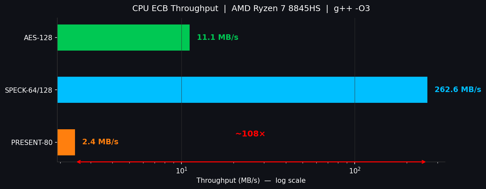
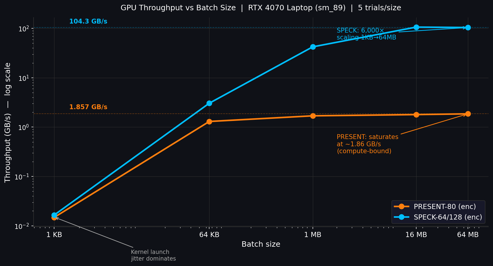
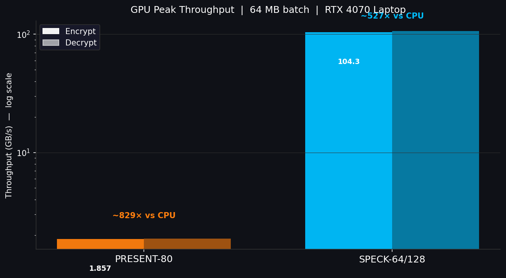
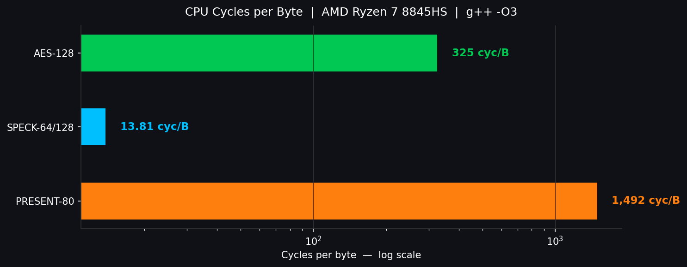
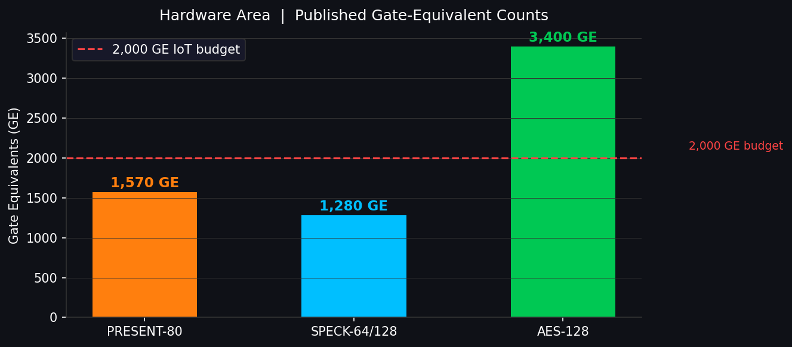
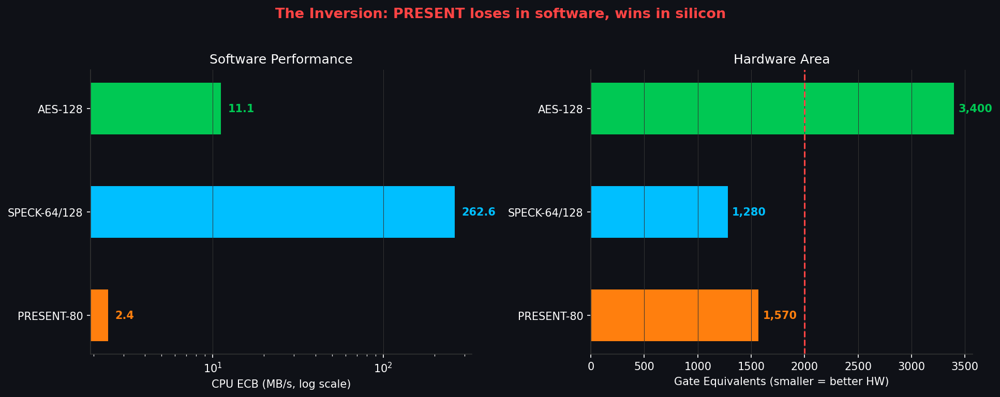

# Claude Design Prompt: 2.5-Minute Presentation
# "Lightweight Block Ciphers for Constrained Devices: PRESENT-80 vs SPECK-64 vs AES"

---

## Instructions for Claude Design

Create a **5-slide academic presentation deck** for a **2.5-minute in-class talk** (ECE268 GPU Cryptography, UCSD, June 4, 2026). Style: clean, technical, dark-background preferred. Each slide has ONE headline message. Use exact numbers as written — do not round. Include log-scale charts where indicated. Font: monospace or technical sans-serif.

---

## Slide 1: Hook — "Not All Lightweight Ciphers Are Lightweight"

**Headline:** Two ciphers with the same job description run ~108× apart in software.

**Content:**
- Both PRESENT-80 and SPECK-64/128 are ISO "lightweight" block ciphers for IoT/RFID
- In our measured CPU benchmark (AMD Ryzen 7 8845HS, g++ -O3):
  - **SPECK-64/128: 262.6 MB/s**
  - **PRESENT-80: 2.43 MB/s**
  - Gap: **~108×** — same category, same 64-bit block size
- Root cause: algorithm family (ARX vs. SPN with bit-permutation) decides everything in software

**Visual Design:** Giant centered "**~108×**" in accent color. Two cipher labels flanking it: "PRESENT-80  ←  ~108×  →  SPECK-64". Subtitle below: *"Same block size. Same IoT target. Measured on identical hardware."*

**Pre-generated figure (use directly):**

**Speaker time:** ~20 seconds. Open cold — no preamble.

---

## Slide 2: What We Built

**Headline:** Three from-scratch ciphers, two on GPU, two modes each — apples-to-apples.

**Content table:**

| Cipher | Structure | Block | Key | Rounds | CPU | GPU | Validation |
|--------|-----------|-------|-----|--------|-----|-----|------------|
| PRESENT-80 | SPN | 64-bit | 80-bit | 31 | ✓ | ✓ | 4 CHES-2007 vectors |
| SPECK-64/128 | ARX | 64-bit | 128-bit | 27 | ✓ | ✓ | NSA official vector |
| AES-128 | SPN | 128-bit | 128-bit | 10 | ✓ | — | 2 FIPS-197 vectors |

- Modes implemented: **CTR** (parallelizable) + **CBC** (sequential) for all three
- GPU: RTX 4070 Laptop (sm_89), nvcc -O3 | CPU: Ryzen 7 8845HS @ 3.8 GHz, g++ -O3
- **No third-party crypto libraries. All from scratch.**
- Software complexity tracks the algorithm family: **PRESENT GPU kernel: 17,111 PTX lines vs SPECK: 422 lines** — a 45× difference driven entirely by the unrolled bit-permutation

**Visual Design:** 3-column cipher card strip (one card per cipher), each with a small structural icon: PRESENT = nested boxes (S-box + permutation), SPECK = two arrows (rotate/add), AES = 4×4 grid. Green checkmarks for validation. Add a small "PTX lines" badge on the PRESENT and SPECK cards (17,111 vs 422).

**Speaker time:** ~20 seconds. Do not read the table aloud; gesture at it and say "validated, all from scratch."

---

## Slide 3: The Headline Results

**Headline:** SPECK wins software; even our naive AES beats PRESENT; GPU lifts both but SPECK runs away at scale.

**CPU throughput (ECB mode, 8 MB bulk, single core):**

| Cipher | Cyc/byte | ECB MB/s | CTR MB/s | CBC MB/s | KS cycles |
|--------|----------|----------|----------|----------|-----------|
| PRESENT-80 | **1,492** | 2.43 | 0.72 | 0.69 | 21,247 |
| SPECK-64/128 | **13.81** | 262.6 | 220.5 | 152.6 | 184 |
| AES-128 (no AES-NI) | **325.3** | 11.14 | 10.91 | 11.02 | 665 |

**GPU throughput vs input size (kernel only, RTX 4070 Laptop, Enc GB/s mean of 5 trials):**

| Cipher | 1 KB | 64 KB | 1 MB | 16 MB | 64 MB |
|--------|------|-------|------|-------|-------|
| PRESENT-80 | 0.0148 | 1.301 | 1.693 | 1.794 | 1.857 |
| SPECK-64/128 | 0.0165 | 3.050 | 42.31 | 106.3 | 104.3 |

**GPU peak throughput and speedup (64 MB batch vs 64 MB CPU):**

| Cipher | Peak Enc GB/s | GPU Speedup vs CPU |
|--------|---------------|--------------------|
| PRESENT-80 | 1.857 | **~829×** |
| SPECK-64/128 | **104.3** | **~527×** |

**Pre-generated figures (use directly — all three panels):**
- Panel 1 (CPU log bar): 
- Panel 2 (GPU sweep log-log): 
- Panel 3 (GPU peak bar): 

**Visual Design:** Three panels. (1) "CPU MB/s" — **log scale** (PRESENT at 2.43 is otherwise invisible); annotate "~108×" between SPECK and PRESENT bars. (2) "Throughput vs Input Size" line chart (**log-log**): SPECK ramps from 0.0165 GB/s at 1 KB to 104.3 GB/s at 64 MB, while PRESENT saturates around 1.86 GB/s — show the two curves diverging after 64 KB. (3) "GPU peak GB/s" bars annotating ~527× (SPECK) and ~829× (PRESENT) speedups.

**Speaker time:** ~45 seconds. This is the core slide. Walk left to right: CPU, then the scaling curve, then GPU peak. Land: *"At small batches both ciphers stall on launch overhead — but at 1 MB and up SPECK takes off to 104 GB/s while PRESENT, compute-bound per thread, flatlines at 1.86."*

---

## Slide 4: Why — Algorithm Family Is Everything

**Headline:** PRESENT's bit permutation is one wire in silicon; it's 64 shift-mask ops on a CPU register.

**Content:**

- **PRESENT bit-permutation:** Each of 64 bits moves to position `(16×i) mod 63` — free in hardware (just route a wire), but on a CPU requires 64 individual mask+shift operations per round × 31 rounds
- **SPECK ARX round:** `x = ROR(x,8) + y ⊕ k;  y = ROL(y,3) ⊕ x` — 3 native CPU instructions, no table lookups, no memory accesses

**Cycles per byte on CPU:**
- PRESENT-80: **1,492 cyc/byte** — ~108× more work than SPECK
- SPECK-64: **13.81 cyc/byte** — 3 CPU ops × 27 rounds
- AES-128: **325.3 cyc/byte** (table-based MixColumns; needs AES-NI to be competitive)

**Key-schedule cost (all now reliable, volatile-sink fix):**
- PRESENT-80: **21,247 cyc/key** | SPECK-64: **184 cyc/key** | AES-128: **665 cyc/key**

**GPU compiled size:** PRESENT **620 KB PTX (17,111 lines)** vs SPECK **14 KB (422 lines)** — a **45× difference** reflecting the fully unrolled bit-permutation

**Hardware gate count (published papers):**
- PRESENT-80: **~1,570 GE** (Bogdanov et al., CHES 2007)
- SPECK-64: **~1,280 GE** (Beaulieu et al., NSA 2013)
- AES-128: **~3,400 GE** (serialized, Satoh et al.)

**Pre-generated figures (use directly):**
- Top row (cycles/byte log): 
- Bottom row (gate equivalents): 
- Combined inversion view: 

**Visual Design:** Two-row comparison. Top row: "Cycles/byte" horizontal bars (log scale). Bottom row: "Gate equivalents" horizontal bars (linear). Color-highlight the INVERSION: PRESENT loses on CPU but wins in hardware. Label the bars with exact numbers.

**Speaker time:** ~30 seconds. The one-liner to deliver: *"Bit permutation is free in silicon and expensive in software. That's the whole ~108× story."*

---

## Slide 5: So What — Pick the Right Tool

**Headline:** "Lightweight" is a target, not a label — match the cipher to the silicon you have.

**Decision guide:**

| Deployment Target | Best Choice | Why |
|-------------------|-------------|-----|
| MCU / software (no crypto HW) | **SPECK** | 23.6× faster than AES, ~108× faster than PRESENT |
| ASIC / RFID / <2,000 GE budget | **PRESENT** | ~1,570 GE, smallest footprint |
| Bulk encryption on GPU (CTR mode) | **SPECK** | **104 GB/s** (at ≥16 MB batch) |
| Frequent re-keying in IoT | **SPECK** | SPECK KS: 184 cycles (49 ns), 3.6× faster than AES's 665 cycles |
| General secure default | AES-128 | Most analyzed; use with AES-NI hardware |

**One-sentence takeaway:** *In software, pick SPECK. In silicon, PRESENT earns its name. AES needs its hardware acceleration to compete.*

**Visual Design:** Clean decision flowchart: 3 branches — "Silicon-constrained → PRESENT", "Software / MCU → SPECK", "Bulk / cloud → SPECK (CTR, 104 GB/s)". At the bottom: single bold box reading *"Algorithm family > round count > key size."*

**Speaker time:** ~25 seconds. Read the takeaway line slowly. Then stop.

---

## Deck Metadata for Claude Design

- **Aspect ratio:** 16:9 widescreen
- **Color scheme:** Dark background (#0f1117 or deep navy), white body text, accent color: electric blue or orange for key numbers
- **Font:** JetBrains Mono or Inter for headlines; system sans for body
- **Logo / watermark:** ECE268 UCSD in bottom-right corner of every slide
- **Slide numbers:** Bottom-center
- **Total runtime:** 2 minutes 30 seconds across 5 slides

## Sources (actual log files)
- CPU benchmark + KS fix + input-size sweep: `logs/cpu_sweep_fixed_20260531_195149.log`
- GPU PRESENT-80 sweep (5 trials × 5 sizes): `logs/gpu_present80_sweep_20260531_193816.log`
- GPU SPECK-64 sweep (5 trials × 5 sizes): `logs/gpu_speck64_sweep_20260531_193818.log`
- PTX/cubin sizes (sm_89): `logs/ptx_size_20260531_193819.log`
